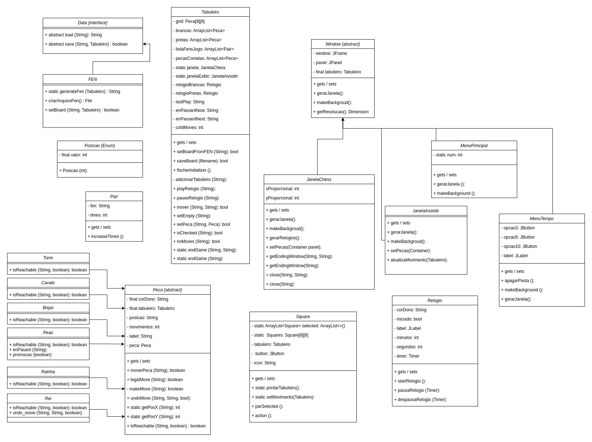

Projeto MC322


Implementation
-----
Diagrama UML:


Vídeo do Projeto:
https://drive.google.com/file/d/1svUL9K7DqLj2aeXQlk_bTihVFPm1dH1j/view?usp=sharing
-> obs: o diagrama mostrado no vídeo ainda está sem as setas de associação, sendo a versão acima a mais recente.

Resumo
-----
* **Sobre as classes utilizadas**
-----
- **Classe Tabuleiro**: principal classe do projeto, ela é responsável por mover efetivamente as peças pelo tabuleiro, verificar se algum dos jogadores está em xeque e por verificar se o jogo acabou. Entre seus principais atributos, constam um grid 8x8, que representa a matriz do tabuleiro onde o jogo acontece; 3 listas (ArrayList) de peças, sendo uma delas referentes às peças brancas em jogo, outra referente às pretas em jogo e, por fim, uma lista que armazena as peças que foram capturadas ao longo da partida; uma lista de “FENs” (ArrayList), que armazena as diferentes configurações do tabuleiro ao longo do jogo; e 2 relógios, responsáveis pelo controle do tempo disponível para cada jogador.
O motivo de usarmos ArrayList para as listas de peças ao invés de listas estáticas decorre do fato de que essas listas precisam ser alteradas ao longo do jogo, conforme ocorrem as capturas.
- **Classe Peca**: abstrai o conceito de uma peça de xadrez, contando com os atributos tabuleiro, corDono (que indica se a peça em questão é branca ou preta), posição (que mantém atualizada a casa do tabuleiro que a peça está ocupando em cada momento do jogo), movimentos (que mantém atualizada a quantidade de movimentos executados pela peça ao longo do jogo) e label (String referente à notação de cada peça na notação FEN).
Na implementação desta classe, foram utilizados os conceitos de classe abstrata e herança para possibilitar a sobrescrita do método abstrato isReachable, o qual é responsável por determinar se uma peça é capaz de alcançar uma casa de destino do tabuleiro, passada como parâmetro. Como cada peça de xadrez tem seu movimento particular, criamos 6 classes filhas da classe Peca (Peao, Rei, Rainha, Torre, Bispo e Cavalo), de modo que cada uma delas implementa o método isReachable levando em consideração as particularidades do movimento de cada peça. Entre tais particularidades, podemos citar 2 lances. O primeiro deles, específico da classe Peao, é o enPassant, que consiste em um movimento no qual um peão pode realizar a captura sobre um peão adversário “de passagem”, ou seja, de uma forma diferente da captura canônica desta peça. Outro movimento que merece destaque é o roque, que, implementado na classe Rei, configura-se como a única situação de um jogo de xadrez na qual podemos mover 2 peças ao mesmo tempo, sendo um rei e uma torre.
- **Classe Window**: classe abstrata utilizada para a elaboração da interface gráfica de nosso projeto, a qual foi feita também em linguagem Java por meio do pacote Swing.
- **Classe Data**: interface que contém a declaração dos métodos “load” e “save”, responsáveis pela manipulação de arquivos do projeto. Tal interface é implementada na classe FEN, a qual, por meio de uma notação característica de cada peça, consegue manter o tabuleiro corretamente atualizado durante a partida.

-----
* **Sobre o movimento de uma peça**
-----
Para mover uma peça, partimos do método mover da classe Tabuleiro, o qual trata a exceção caso o movimento em questão não possa ser realizado. Tal método realiza a chamada de moverPeca na classe Peca, o qual verifica, em primeiro lugar, por meio do método isReachable particular de cada peça, se a peça em questão consegue atingir a casa de destino no tabuleiro.
A seguir, é verificado se este movimento não irá colocar o próprio jogador que está executando-o em xeque. Isso é feito por meio do método isChecked da classe Tabuleiro, que percorre a lista de peças do adversário verificando se alguma delas pode atingir a casa onde o rei do jogador em questão se encontra naquele momento do jogo, novamente usando o método isReachable. Caso isso ocorra, o movimento é considerado inválido e não é realizado no tabuleiro. 
Tendo validado o movimento, o próximo passo do método moverPeca é verificar se o movimento realizado coloca o adversário em xeque, por meio do método isChecked, e se o adversário não pode realizar nenhum movimento, por meio do método noMoves, também da classe Tabuleiro. Se essas duas condições forem verdadeiras, trata-se de uma situação de xeque-mate, na qual o jogo se encerra com a vitória do jogador que realizou o último movimento. Se apenas a segunda condição for satisfeita, significa que o adversaŕio, apesar de não estar em xeque, não é capaz de realizar nenhum movimento que não o coloque em xeque, o que configura um término de partida por afogamento, na qual nenhum dos jogadores sai vitorioso (empate). Por fim, se nenhuma das 2 condições é satisfeita, ou se apenas o método isChecked retorna “true”, trata-se de um lance que não encerra a partida, a qual prosseguirá com um movimento do outro jogador.

-----
* **Em prática**
-----
Assim que executar o código do projeto, o usuário irá se deparar com a tela do menu principal, na qual há 3 opções: jogar, assistir jogo e sair. Clicando em “jogar”, os jogadores podem escolher uma entre três opções de tempo: 3, 5 ou 10 minutos. Após escolher o selecionar o tempo, a interface gráfica irá exibir o tabuleiro com as peças em suas devidas posições iniciais. Agora, basta que cada jogador execute lances alternados com seu adversário, começando pelas peças brancas. Para mover uma peça, basta que o usuário clique primeiro sobre a peça que deseja movimentar, e então clique na casa para a qual ele deseja levá-la. Caso isso não altere o tabuleiro, trata-se de um movimento inválido para aquela situação do jogo.
```
Extra refs
-----
  * https://en.wikipedia.org/wiki/Chess_piece
  * https://en.wikipedia.org/wiki/Forsyth%E2%80%93Edwards_Notation
  * https://en.wikipedia.org/wiki/Fischer_random_chess
