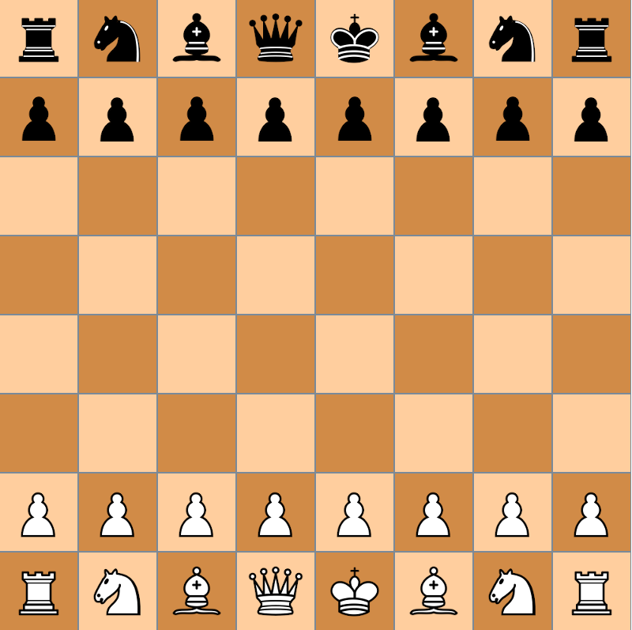

# Xadrez
Projeto final de **MC322** - 1°semestre/2023
* Lucas Martiniano - 231036
* Daniel da Cruz - 260398
* Guilherme Ferreira - 260469
* Kairé Pereira - 260558



Implementation
-----
Diagrama UML:

Usage
-----
```java

```
Extra refs
-----
  * https://en.wikipedia.org/wiki/Chessboard
  * https://en.wikipedia.org/wiki/Forsyth%E2%80%93Edwards_Notation
  * https://en.wikipedia.org/wiki/Fischer_random_chess
