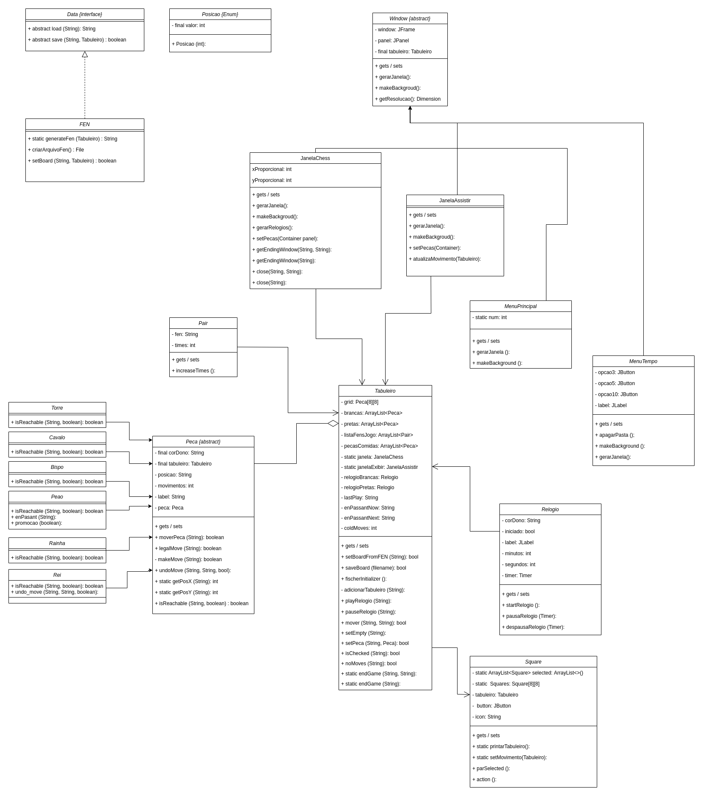

Projeto MC322


Implementation
-----
Diagrama UML:


Usage
-----
```java

```
Extra refs
-----
  * https://en.wikipedia.org/wiki/Chess_piece
  * https://en.wikipedia.org/wiki/Forsyth%E2%80%93Edwards_Notation
  * https://en.wikipedia.org/wiki/Fischer_random_chess
